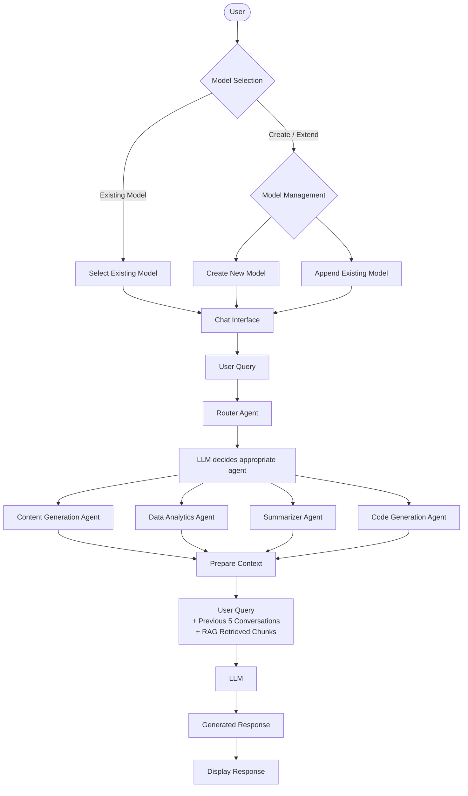
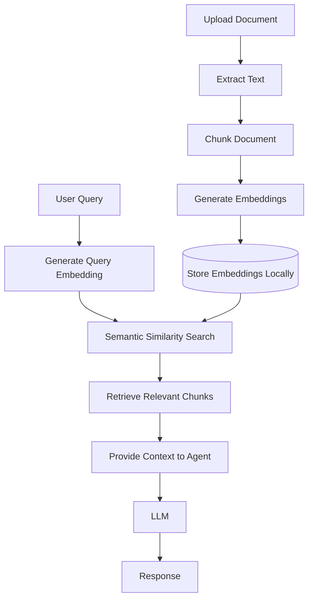

# 🤖 Agentic RAG Knowledge Platform

A full-stack AI application that enables users to create, extend, and interact with document-based knowledge models using **Agentic AI** and **Retrieval-Augmented Generation (RAG)**.

The application grounds LLM responses in user-provided documents through semantic retrieval and an agent-based workflow, enabling accurate, context-aware conversations.

---

## ✨ Key Features

- 📂 Create knowledge models from uploaded documents
- ➕ Append new documents to existing models
- 💬 Chat with any selected knowledge model
- 🧠 Intelligent agent-based query routing
- 🔍 Semantic search using RAG
- 📝 Multi-turn conversation history
- ⚡ In-memory model caching for improved performance

---

## 🏗️ Application Workflow



---

## 🤖 Agentic AI Pipeline

Each query is processed using a Router Agent that determines the most suitable specialized agent.

Available agents:

- 📝 **Content Generation Agent**
- 📊 **Data Analytics Agent**
- 📚 **Summarizer Agent**
- 💻 **Code Generation Agent**

The selected agent receives:

- User query
- Recent conversation history
- Relevant document chunks retrieved through RAG

before generating the final response.

---

## 🔍 Retrieval-Augmented Generation (RAG)



---

## ⚡ Performance Optimization

To reduce repeated model loading, the backend maintains an **in-memory cache** of active knowledge models.

- Maximum **5 active models**
- Stores document chunks and vector data
- Tracks model usage frequency
- Evicts the least-used model when the cache is full

---

## 🌐 REST API Endpoints

| Endpoint | Method | Description |
|----------|--------|-------------|
| `/api/models` | GET | Retrieve available knowledge models |
| `/api/query` | POST | Submit selected model and user query |
| `/api/reply` | GET | Generate AI response |
| `/api/file` | POST | Create or append a knowledge model |

---

## 🛠️ Technology Stack

**Frontend**
- React
- HTML/CSS

**Backend**
- Python
- Flask
- REST APIs

**AI**
- Agentic AI
- Retrieval-Augmented Generation (RAG)
- Vector Embeddings
- Large Language Models (LLMs)

---

## 🚀 Getting Started

### Backend

```bash
cd backend
python -m venv venv

# Linux/macOS
source venv/bin/activate

# Windows
venv\Scripts\activate

pip install -r requirements.txt
python main.py
```

### Frontend

```bash
cd frontend
npm install
npm run dev
```

---

## 📈 Future Enhancements

- Store embeddings in Vector DB
- Authentication
- Cloud deployment
- Persistent conversation storage
- Advanced multi-agent orchestration

## Project Link 
https://drive.google.com/file/d/1pYFnQghUNGBs1lvOTj4XCwfmDvFANvgX/view?usp=sharing
